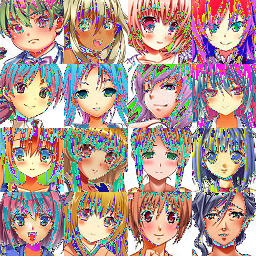
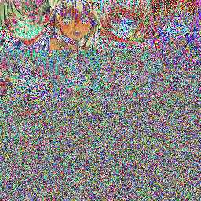
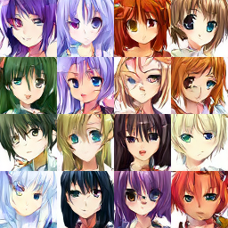

# Anime Face Diffusion Model

基于 PyTorch 和 HuggingFace Diffusers 实现的 **DDPM（Denoising Diffusion Probabilistic Models）**，用于生成 64×64 动漫风格人脸。

---

## 项目架构

```
main.py                     # 入口脚本
├── diffusion_loader.py     # 数据加载 & 噪声可视化
└── Unet_accelerate.py      # UNet 模型定义 & 训练循环
```

- **扩散调度器**: `DDPMScheduler`，1000 步线性 beta schedule (`1e-4` → `0.02`)
- **预测目标**: epsilon prediction（预测添加的噪声而非原图）
- **混合精度**: FP16，通过 HuggingFace `accelerate` 实现
- **日志**: TensorBoard

---

## UNet 网络结构

| 层级 | 类型 | 通道数 |
|------|------|--------|
| Down 0-3 | DownBlock2D | 128, 128, 256, 256 |
| Down 4 | **AttnDownBlock2D** | 512 |
| Down 5 | DownBlock2D | 512 |
| Up 0 | UpBlock2D | 512 |
| Up 1 | **AttnUpBlock2D** | 512 |
| Up 2-5 | UpBlock2D | 256, 256, 128, 128 |

- 每个 block 含 2 层 ResNet
- 在第 5 层下采样和第 2 层上采样引入自注意力机制
- 输入/输出：3 通道 RGB，分辨率 64×64

---

## 环境依赖

核心依赖：

| 包 | 版本 |
|---|------|
| PyTorch | 2.11.0+cu126 |
| diffusers | 0.38.0 |
| accelerate | 1.13.0 |
| datasets | 4.8.5 |
| torchvision | 0.26.0 |
| tensorboard | 2.20.0 |

完整依赖见 [`requirements.txt`](./requirements.txt)。

```bash
pip install -r requirements.txt
```

---

## 数据集

使用 HuggingFace `datasets` 加载本地图片数据集，放在 `data/` 目录下：

```
data/
└── *.png          # 21,552 张 64×64 动漫人脸 PNG 图片
```

数据预处理：
- `Resize` → 64×64
- `RandomHorizontalFlip`（数据增强）
- `ToTensor` + `Normalize(0.5, 0.5)` → 像素映射到 `[-1, 1]`

---

## 使用方法

### 运行训练 & 噪声可视化

```bash
python main.py
```

`main.py` 会依次执行：
1. **噪声可视化** (`add_noise()`) — 生成 `example/clean.png` 和 `example/noisy.png`，展示前向扩散过程
2. **模型训练** (`Unet_ac()`) — 训练 3 个 epoch，每 epoch 保存模型并生成样本

### 输出文件

```
anime-64/
├── config.json                          # UNet 配置
├── scheduler_config.json                # 调度器配置
├── unet/
│   ├── config.json
│   └── diffusion_pytorch_model.safetensors  # 模型权重
├── model_index.json                     # Pipeline 描述
├── samples/
│   └── 0002.png                         # 生成样本 (4×4 网格)
└── logs/train_example/                  # TensorBoard 日志
```

### 查看训练曲线

```bash
tensorboard --logdir anime-64/logs
```

---

## 训练参数

| 参数 | 值 |
|------|-----|
| Epochs | 3 |
| Batch Size | 16 |
| Learning Rate | 1e-4 |
| Warmup Steps | 500 |
| Optimizer | AdamW |
| LR Schedule | Cosine with Warmup |
| Mixed Precision | FP16 |
| Gradient Clipping | max norm = 1.0 |
| Image Size | 64×64 |

## 示例可视化

### 前向扩散过程 \
\



| 原始图片 (`example/clean.png`) | 加噪后 (`example/noisy.png`) |
|--------------------------------|------------------------------|
| 干净动漫人脸 | 逐步添加噪声的效果 |

### 生成样本

`anime-64/samples/0002.png` — 训练完成后模型生成的动漫人脸（4×4 网格）。 \
 \
训练结果图片已放入文件中。

---
该文主要是参考了Mastering pytorch当中对于Unet架构的介绍和代码块对其扩散模型代码的复现，数据集来源如下。

参考文献\
[1]去噪扩散概率模型：https://arxiv.org/abs/2006.11239 \
[2]Huggingface Accelerate库:https://huggingface.co/docs/accelerate/index \
[3]Huggingface Diffuser库:https://huggingface.co/docs/diffuser/index \
[4]Huggingface anime-faces: https://huggingface.co/datasets/huggan/anime-faces \
[5]Matering Pytorch,2nd Edition 